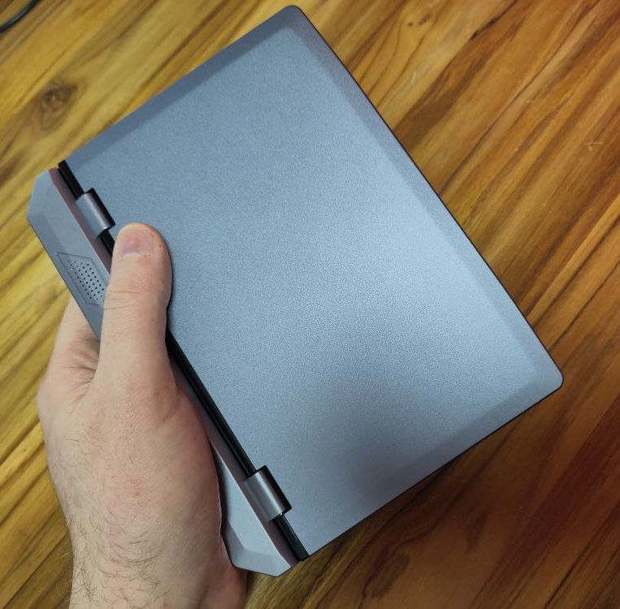
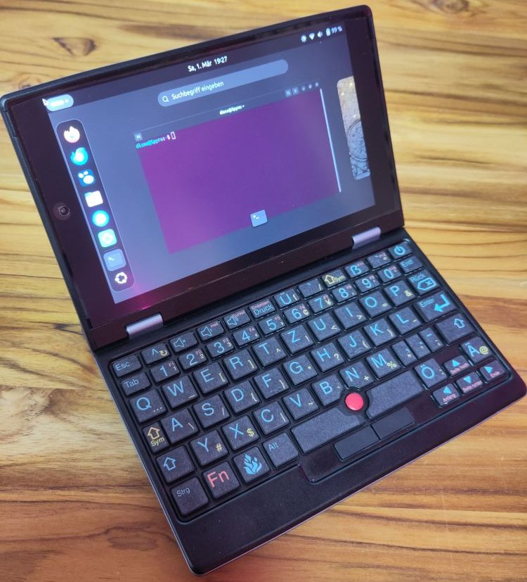

# 7-inch-Laptop
7 Inch Laptop, LONGEVINCE 7 Zoll Touchscreen Mini Laptop, Celeron N4000, 12GB RAM - Linux setup

#7Zoll #Linux #Notebook #Laptop #Cyberdeck #Chinashit #NeoQuerz #Kingnovy

💚 Touchscreen

💚 WiFi / Bluetooth

💚 Sound

💚 Kamera

💚 Battery

💚 Display

💚 Standby

🔴 Maus

🔴 kein USB-C


Getestet 2025 mit Linux Kernel 6.14 Ubuntu 24.04 LTS (Mainline Kernel Update)

Diese kleinen Laptops werden sehr [günstig](https://de.aliexpress.com/w/wholesale-7-inch-laptop.html?spm=a2g0o.home.search.0) mit Windows 11 verkauft und sind hevorragend für Linux geeignet. 
Leider haben die Laptops keinen eindeutigen Markennamen aber unter dem Begriff 7 Inch Laptop wird man ganz gut fündig. 

Hier ein paar Blogbeiträge die auch interresant seien dürften: 

[cameralabs.com](https://www.cameralabs.com/kingnovy-7in-mini-laptop-review/) -review

[http://vitor.io](http://vitor.io/notes-7-inch-mini-laptop)

[paperstack.com](https://paperstack.com/palmtop/) - review


Ein paar Probleme sind allerdings zu lösen: 



- # Maussteuerung aktivieren
- Die Maustasten sind Numpad_5 und Menu was seltsam ist. Um sie zu nutzen muss die Maussteuerung aktiviert sein `gsettings set org.gnome.desktop.a11y.keyboard mousekeys-enable true` bzw. über die Gnome einstellungen.
- 
- Als script
  ```
  #!/bin/bash
  gsettings set org.gnome.desktop.a11y.keyboard mousekeys-enable false
  gsettings set org.gnome.desktop.a11y.keyboard mousekeys-enable true
  ```
- # Display drehen
- `fbcon=rotate:1 video=DSI-1:panel_orientation=right_side_up`
  in Kernel CMDLINE eintragen z.B. mit `rpm-ostree kargs --editor`
  
- # Fehlende AltGr Taste kompensieren
- Das Gerät hat keine AltGr Taste, somit ist es im deutschem Layout z.B. nicht möglich [ ] eckige Klammern, | , etc. zu schreiben. 
-
-Die Lösung hierfür ist [NeoQwertz](https://neo-layout.org/Layouts/neoqwertz/)
- NeoQUERZ-Tastaturlayout in der Gnome Layout-Auswahl aktivieren mit: `gsettings set org.gnome.desktop.input-sources show-all-sources true`
- Ich habe dir eine passende [Tastaturbeschriftung](7inchKeyboardStickerNeoQUERZ.svg) mit Inkscape erstellt, diese musst du nur mit Inkscape öffnen und auf selbstklebendem Papier ausdrucken und mit transparenter Klebefolie oder Klebeband laminieren, anschließend ausschneiden und aufkleben.


  
- # Touchscreen nach standby wieder aktivieren
-
-Der Touchsreen funktioniert wohl ab Kernel 6.12 aber nach einem standby wacht er nicht wieder auf. 
Die Lösung hierfür:

- Script anlegen
- 
  ```
  #!/bin/bash
  
  sudo modprobe -r goodix_ts
  sudo modprobe goodix_ts
  
  ```
  und mit `sudo chmod +x touchscreen.sh` ausführbar  machen  
- Dann Systemd-unit `sudo nano /etc/systemd/system/touchscreen.service`
   anlegen die nach dem Standby script ausführt  
  ```
  [Unit]
  Description=Run script after waking up from suspend
  After=suspend.target
  
  [Service]
  Type=oneshot
  ExecStart=/path/to/script/touchscreen.sh
  
  [Install]
  WantedBy=suspend.target
```

  und mit `sudo systemctl enable touchscreen.service` aktivieren  
	- soll das script auch manuell oder per Keyboard-shortcut ausgeführt werden ggf. die `sudo visudo` anpassen und 
	  ```
	  #Touchscreen-dirtyfix
	  USERNAMEHERE ALL=(ALL) NOPASSWD: /path/to/script/touchscreen.sh
	  
	  ```
	  hinzufügen  
	-
- # Touchkeyboard deaktivieren
	-
	- wenn das Onscreen Keyboard aufploppt und dich das nervt dann kann das hiermit gefixt werden:
	  ```
	  Touchkeyboard deaktivieren
	  
	  gsettings set org.gnome.desktop.a11y.applications screen-keyboard-enabled false
	  
	  ~/.config/autostart
	  
	  [Desktop Entry]
	  Name=BlockOSK
	  Icon=
	  Type=Application
	  Exec=gsettings set org.gnome.desktop.a11y.applications screen-keyboard-enabled false
	  Terminal=false
	  
	  oder 
	  
	  Systemd service
	  
	  nano /etc/systemd/user/blockosk.service
	  
	  [Unit]
	  Description=BlockOSK
	  [Service]
	  Type=oneshot
	  ExecStart=gsettings set org.gnome.desktop.a11y.applications screen-keyboard-enabled false
	  [Install]
	  WantedBy=graphical.target
	  
	  sudo systemctl enable blockosk.service
	  sudo systemctl start blockosk.service
	  
	  (chmod +x /full/path/to/hide-script.sh)
	  
	  ```
# Fazit
Alles in Allem ein genial kleines Gerät was mit seinen 4-5W Stromverbrauch recht lange, etwa 4-5h durchhält. Die Entscheidung, vom Hersteller, anstelle der Maustasten, Keyboard_kommandos (Num_5 und Menu) für die Maustasten zu verwenden, ist dämlich und könnte irgendwann, in Zukunft, zu Problemen führen. Mit Gnome 47 startete z.B. die grafische Benutzeroberfläche nicht auf Grund eines Bugs mit der aktivierten Tastaturmaus. Also schlug mein Test mit Fedora 41 ersteinmal fehl. Ein Ubuntu LTS mit instaliertem Mainline-Kernel tut es aber auch erstmal. 
Aber dennoch ein nettes kleines Cyberdeck zum schmalen Taler. 
